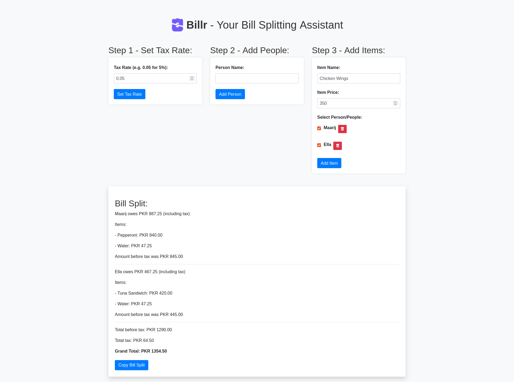

#  Billr: Fair Bill Splitting Calculator

**Billr** is a web-based bill splitting calculator that helps you easily calculate the amount each person owes when splitting a restaurant bill. Whether you're with friends, family, or colleagues, Billr ensures a fair distribution of expenses.

## Features

- Calculate individual and shared expenses.
- Set the tax rate to accurately calculate totals.
- Add people's names and the items they ordered.
- Display a transparent breakdown of costs including tax.

## Screenshot

## Link to Billr

Billr can be accessed at https://billr.vercel.app

## Usage

1. Set the Tax Rate: Enter the tax rate (e.g., 0.05 for 5%) to calculate totals accurately.

2. Add People: Enter the names of individuals involved in the bill split.

3. Add Items: Enter the item name, price, and select the people who ordered/shared the item.

4. Review Bill Split: The app will display a detailed breakdown of costs, including individual and shared expenses.

5. Copy Bill Split: Use the copy button to copy the entire bill split and easily share it anywhere.

## Contributing

Contributions are welcome! Fork the repository, create a new branch, and submit a pull request.

---

Built with ❤️ by [Muhammad Maarij](https://github.com/mmaarij)
